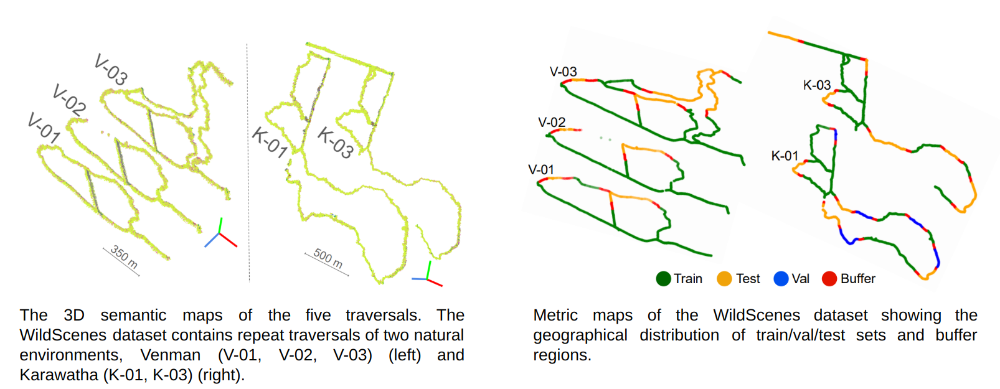
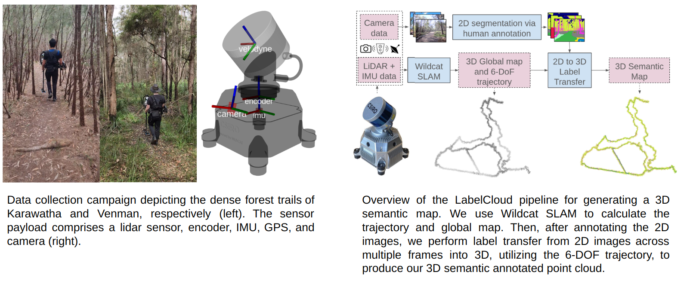
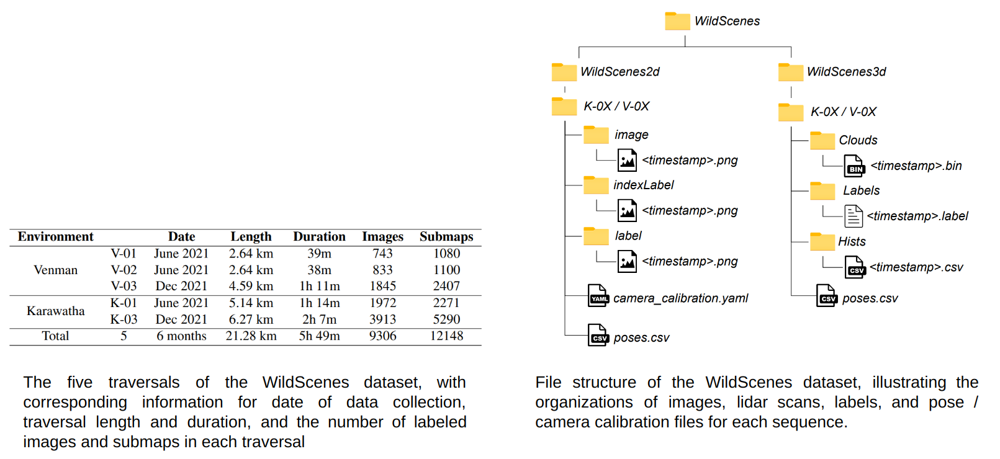
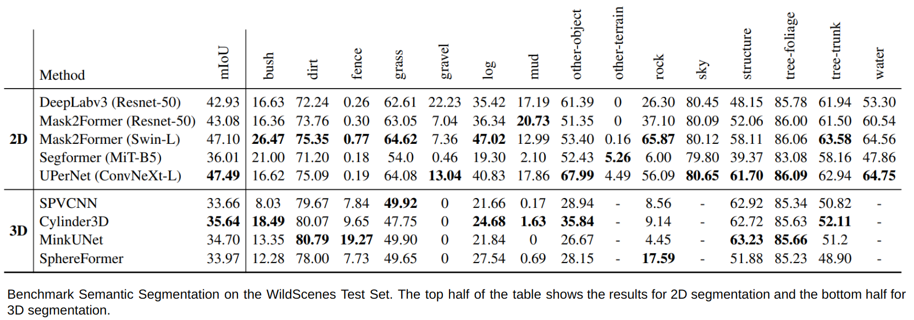
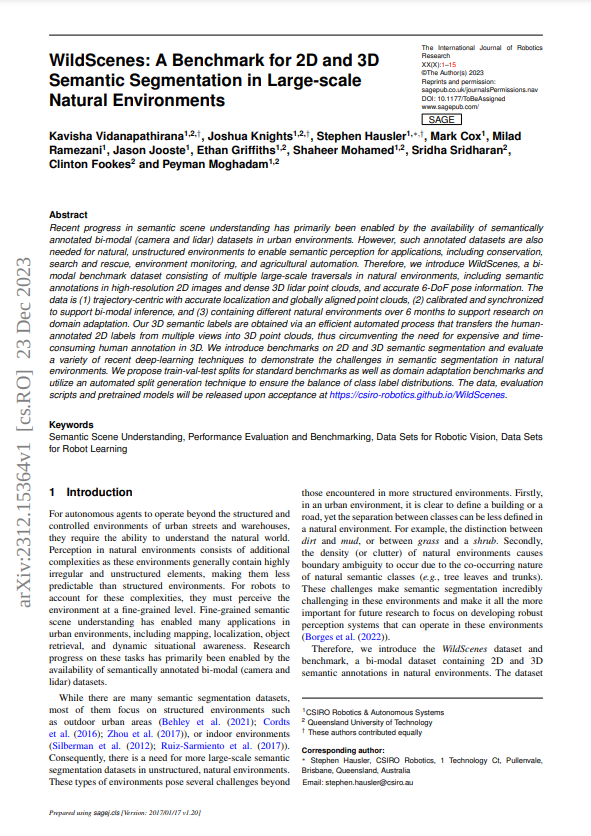

## Wild-Scenes: A benchmark for 2D and 3D Semantic Segmentation in Natural Environments

### Abstract

Recent progress in semantic scene understanding has primarily been enabled by the availability of semantically annotated bi-modal (camera and LiDAR) datasets in urban environments. However such annotated datasets are also needed for natural, unstructured environments to enable semantic perception for important applications including search and rescue, conservation monitoring and agricultural automation. Therefore we introduce Wild-Scenes, a bi-modal dataset including densely annotated semantic annotations in both 2D (images) and 3D (lidar point clouds), alongside 6-DoF ground truth information. We introduce benchmarks on 2D and 3D semantic segmentation and evaluate using a variety of recent deep learning techniques, to demonstrate the challenges in semantic inference in natural environments. Additionally, our dataset also provides a method for accurately projecting 2D labels into 3D, and we also provide a custom split generation algorithm to produce an optimal label distribution for training neural networks on our dataset. Finally, for the first time our dataset provides label distributions for all 3D points, enabling future applications such as label distribution learning.

### Dataset Information
#### Location

#### Collection 

#### Contents

#### Comparison to other datasets

### Download

### GitHub

### Paper

               
            
<a href="https://arxiv.org/abs/2312.15364"><strong>Pre-print of our  paper: "WildScenes: A Benchmark for 2D and 3D Semantic Segmentation in Large-scale Natural Environments"</strong></a>

         

### Citation

If you find this paper helpful for your research, please cite our paper using the following reference:

<code>
@misc{vidanapathirana2023wildscenes,
      title={WildScenes: A Benchmark for 2D and 3D Semantic Segmentation in Large-scale Natural Environments}, 
      author={Kavisha Vidanapathirana and Joshua Knights and Stephen Hausler and Mark Cox and Milad Ramezani and Jason Jooste and Ethan Griffiths and Shaheer Mohamed and Sridha Sridharan and Clinton Fookes and Peyman Moghadam},
      year={2023},
      eprint={2312.15364},
      archivePrefix={arXiv},
      primaryClass={cs.RO}
}
</code>

